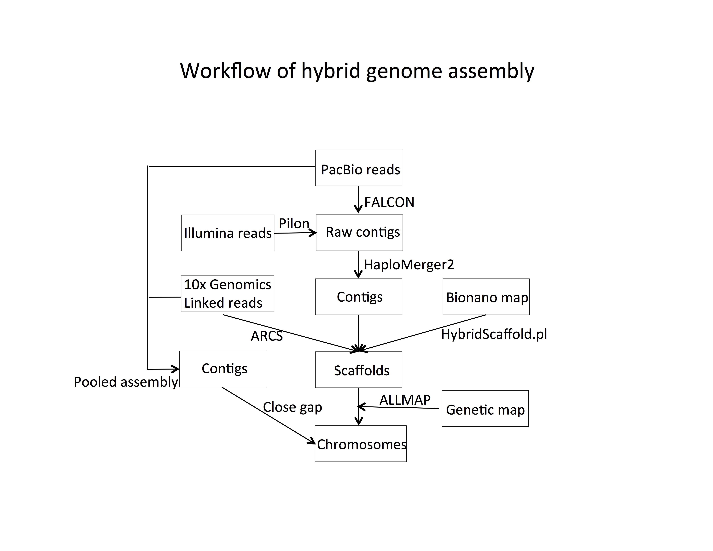

+ Assemble Pacbio long reads with Falcon

```shell
#/rhome/cjinfeng/BigData/00.RD/Assembly/Pacbio/FALCON_v3.0/virtualenv/FALCON_v3.0/Citrus/Pacbio_raw_plus_20kb
sbatch Assembly_FALCON.sh
```

+ Polish the assembly with Quiver

```shell
#original assembly: /rhome/cjinfeng/BigData/00.RD/Assembly/Pacbio/FALCON_v3.0/virtualenv/FALCON_v3.0/Citrus/Pacbio_raw_plus_20kb/2-asm-falcon_min2_12k/
perl fastaDeal.pl --reform line50 citrus_ass_FALCONv3_20kb.fa > citrus_ass_FALCONv3_20kb_line50.fa 
perl fastaDeal.pl --attr id citrus_ass_FALCONv3_20kb.fa > citrus_ass_FALCONv3_20kb.id
perl getidseq.pl -l citrus_ass_FALCONv3_20kb.id -f citrus_ass_FALCONv3_20kb_line50.fa -o citrus_ass_FALCONv3_20kb_line50_clean.fa
perl step1_Mapping_h5_pbalign_bam.pl --ref /rhome/cjinfeng/BigData/00.RD/Assembly/Pacbio/ReadMapping_pbalign/citrus_ass_FALCONv3_20kb_line50_clean.fa --input /rhome/cjinfeng/BigData/00.RD/Assembly/Pacbio/ReadMapping_pbalign/input.Citrus_highqual_and_20kb.fofn --project citrus_ass_FALCONv3_20kb_line50_clean --step 12 --verbose
python Run_Quiver.py --bamdir citrus_ass_FALCONv3_20kb_line50_clean.merged.bam_split_contig --ref citrus_ass_FALCONv3_20kb_line50_clean_split_contig --project citrus_ass_FALCONv3_20kb_line50_clean
perl Finish_Quiver.pl --quiver citrus_ass_FALCONv3_20kb_line50_clean.consensus.fasta --falcon citrus_ass_FALCONv3_20kb_line50_clean.fa --output citrus_ass_FALCONv3_20kb_quiver_round1.fasta
```

+ Polish the assembly with pilon for the first round

```shell
echo "Map illumina paired-end reads of Fairchild to the assembly (mapped to all contigs)"
#~/BigData/00.RD/Assembly/Pacbio/pilon/mapping
sbatch Assembly_pilon_round1_mapping.sh

echo "Polish the assembly with illumina paired-end reads"
#BigData/00.RD/Assembly/Pacbio/pilon/Citrus/Fairchild_falconv3_20kb_cov2_all_ctg_quiver_round1
sbatch Assembly_pilon_round1_polish.sh
```

+ Scaffold contigs with 10x genomics, bionano, and genetic map

```shell
echo "Haplomerger2"
#~/BigData/00.RD/Publication_scripts/citrus_fairchild_scripts/Hybrid_assembly/Assembly_scaffold_haplomerge2/citrus_falconv3_20kb_cov2_p_ctg_quiver_round1_pilon
sbatch Assembly_scaffold_haplomerge2.sh

echo "10x genomics"
#/rhome/cjinfeng/BigData/00.RD/Assembly/10xgenomics/bin/ARCS
sbatch Assembly_scaffold_ARCS_fastq.sh
sbatch Assembly_scaffold_ARCS_align.sh

echo "Bionano genome map"
#/rhome/cjinfeng/BigData/00.RD/Assembly/bionano/bin
sbatch Assembly_scaffold_BNS_stats.sh
sbatch Assembly_scaffold_CMAP_assembly.sh 
sbatch Assembly_scaffold_Hybrid_assembly.sh 

echo "Genetic map"
#/rhome/cjinfeng/BigData/00.RD/Assembly/Pacbio/ALLMAPS/Citrus_falconv3_20kb_cov2_p_ctg_quiver_round1_haplomerge_10x_bionano_hybrid
sbatch Assembly_scaffold_genetic_map.sh 

```

+ Fill gaps in the assembly with 10x genomics-PacBio contigs 

```shell
echo "Assemble pooled PacBio long reads isolated by 10x genomics linked reads"
#/rhome/cjinfeng/BigData/00.RD/Assembly/10xgenomics/bin/assembly_10x_molecular
sbatch Assembly_fill_gap_asm_pooled_reads.sh 

echo "Fill gaps in the assembly (include some manual curation)"
#/rhome/cjinfeng/BigData/00.RD/Assembly/10xgenomics/bin/contig_gragh/fairchild_graph_57G_chr7_bwa_merge
sbatch Assembly_fill_gap_overlap.sh

echo "Finish gap filling and rename scaffold/contig using chromosomes"
#Working directory: /rhome/cjinfeng/BigData/00.RD/Assembly/10xgenomics/bin/contig_gragh/fairchild_graph_57G_merge_all
sbatch Assembly_fill_gap_finish.sh
```

+ Polish the assembly with pilon for a third round after filling gaps with 10x genomics-PacBio contigs.

```shell
echo "Map illumina paired-end reads of Fairchild to the assembly (mapped to primary contigs)"
#Working directory: /rhome/cjinfeng/BigData/00.RD/Assembly/Pacbio/pilon/mapping/
sbatch Assembly_pilon_round3_mapping.sh

echo "Polish the assembly with illumina paired-end reads"
#Working directory: /rhome/cjinfeng/BigData/00.RD/Assembly/Pacbio/pilon/Citrus/Fairchild_contig_graph.raw.named/
sbatch Assembly_pilon_round3_polish.sh
```
